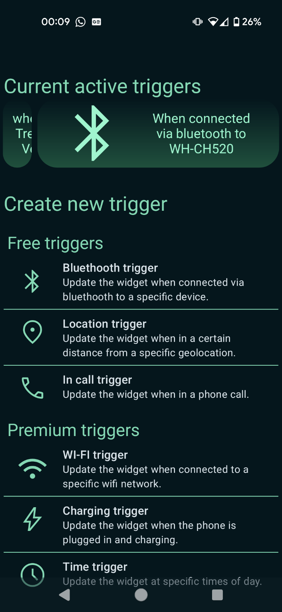
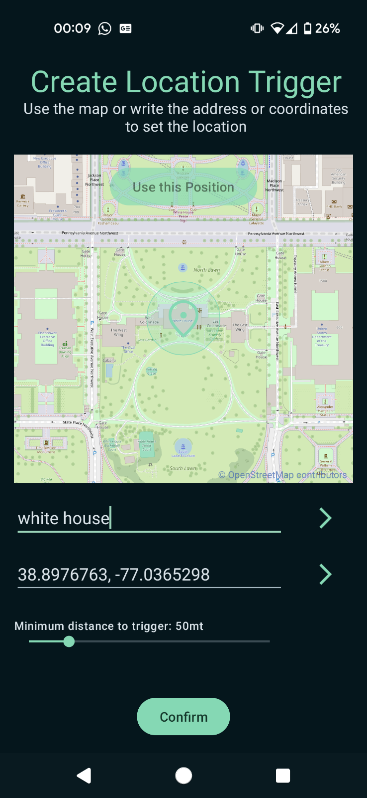
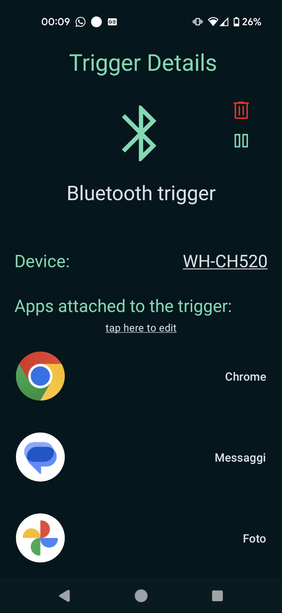
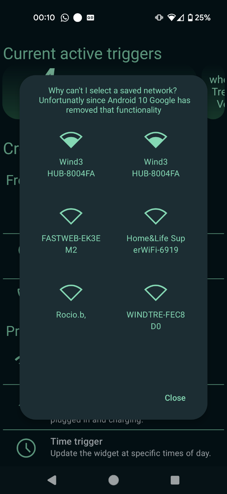
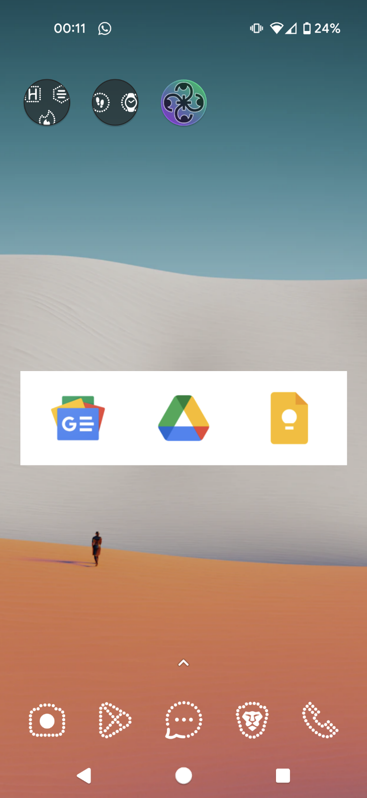

# Trigger-Based Contextual Widget (Prototype)

This is an old project of mine, designed as a proof of concept for a dynamic widget that updates based on user-defined triggers. The idea was that users could set various triggers—such as entering a specific location or connecting to a particular device—and assign apps to those triggers. When the trigger's conditions were met, the widget would update with shortcuts to the selected apps.

### ⚠️ Disclaimer  
**The code is not great.** This was a quick prototype to test the idea and as such I didn't refine the code much. Additionally, there are some parts in the code with italian comments or variables names.

That said, even though this is a rough, poorly organized codebase, I decided to make it public in case it can be useful to someone. Feel free to explore, modify, or take inspiration from it.  

### Status  
🚧 **Project on Hold**  
While I like the idea and it was doable (even with evolving Android permission policies that made implementation more challenging) Due to time constraints, I ultimately put this project on indefinite hold.

### Screenshots

Expand

#### Home page example:

#### Trigger creation example (location in this case):

#### Trigger details example:

#### Wifi selection for trigger:

#### Widget look:

